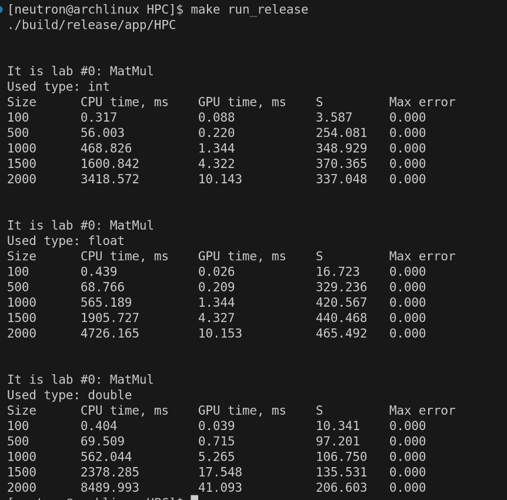

# Лабораторные по HPC  
Лабораторные по высокопроизводительным вычислениям на С++.  

Структура проекта:  
- `app` - точка входа в приложение;
- `core` - интерфейс для лабораторных работ;
- `modules` - реализация лабораторных работ;
- `data` - входные данные для алгоритмов;

Вычислительные эксперименты проводились при следующей конфигурации:
| Тип | Модель |
| ------ | ----- |
| CPU    | AMD Ryzen 9 8945HX, 16 ядер   |
| GPU    | RTX 5070 Mobile, 4608 CUDA cores, 8 GB GDDR7  |
| RAM    | 32 Gb DDR5   |
| OS     | Arch Linux   |

Команды make для сборки и запсука приложения:
- `make release` - сборка release версии
- `make run_release` - запуск release версии

## Лабораторная работа №0
В модуле matmul реализовано перемножение двух матриц на CPU и GPU.
Матрицы хранятся в одномерном векторе. Вычисления реализованы в `runCPU()` и `runGPU()`.  

На GPU каждый поток вычисляет одно значение `C[i, j]` как сумму произведения соответствующих строки `A` на столбец `B`, в то время как на `CPU` один поток вычисляет значения всех элементов `C[i, j]` используя двойной цикл.   

Для проверки корректности работы алгоритма на GPU использовалась функция `verifyResult()`, которая вычисляет максимальную ошибку между результатами последовательного и параллельного алгоритмов.  

Таблица с результатами строится в функции `runExperiment()`.

Результат вычислительного эксперимента на сборке `release` для трёх типов данных:

По результатам видно, что ошибка отсутствует для всех трех типов данных - параллельный алгоритм корректен.

Эффективнее всего видеокарта работает с `float`. `int` на GPU вычисляется столько же, сколько и `float` на GPU, однако `int` на CPU вычисляется быстрее, чем `float` на CPU. При переходе с `float` на `double` время вычислений на GPU увеличивается в 4 раза, а на CPU в 2 раза, из-за чего ускорение падает в 2 раза.

Выполнил: Абельдинов Рафаэль, группа 6132  
2026