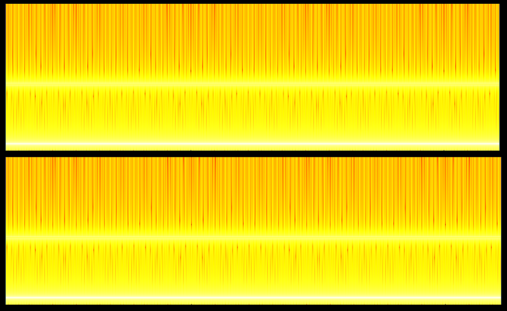
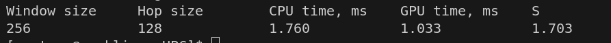
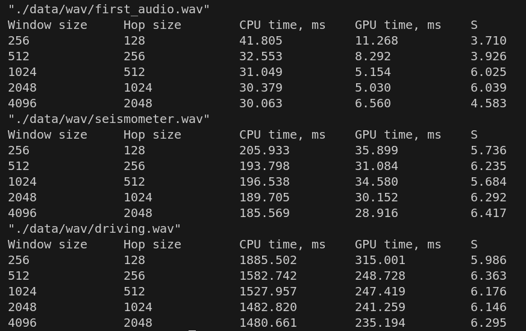
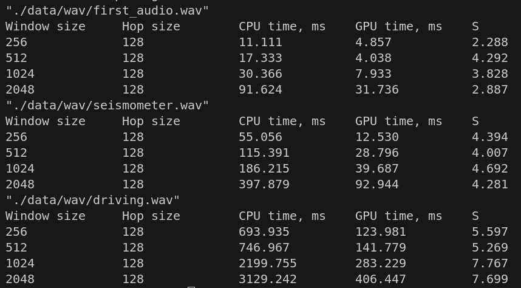
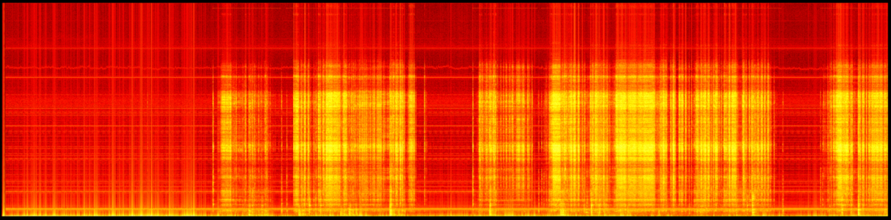
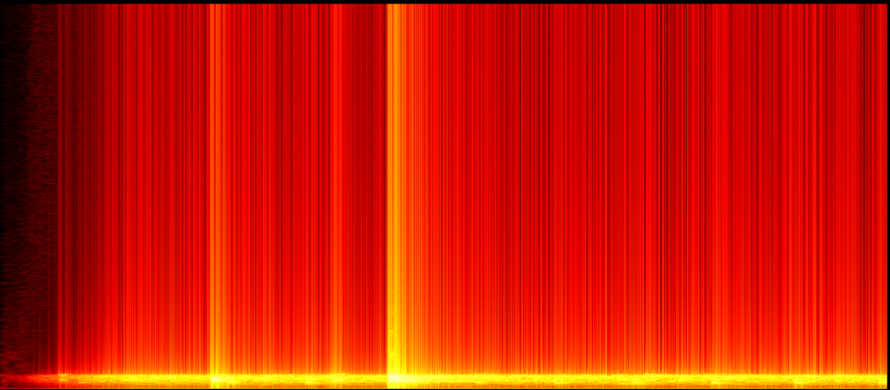

# Лабораторные по HPC  
Лабораторные по высокопроизводительным вычислениям на С++.  

### Выполненные работы:
- [Лабораторная работа #0 (MatMul)](#лабораторная-работа-0)
- [Лабораторная работа #1 (VecSum)](#лабораторная-работа-1)
- [Лабораторная работа #2 (Spectogram)](#лабораторная-работа-2)

### Структура проекта:  
- `app` - точка входа в приложение;
- `core` - интерфейс для лабораторных работ;
- `modules` - реализация лабораторных работ;
- `third_party` - Место для внешних библиотек;

### Конфигурация для проведения вычислительных экспериментов:
| Тип | Модель |
| ------ | ----- |
| CPU    | AMD Ryzen 9 8945HX, 16 ядер   |
| GPU    | RTX 5070 Mobile, 4608 CUDA cores, 8 GB GDDR7  |
| RAM    | 32 Gb DDR5   |
| OS     | Arch Linux   |

### Команды make для сборки и запсука приложения:
- `make release` - сборка release версии
- `make run_release` - запуск release версии

## Лабораторная работа #0
В модуле `matmul` реализовано перемножение двух матриц на CPU и GPU.
Матрицы хранятся в одномерном векторе. Вычисления реализованы в `runCPU()` и `runGPU()`.  

На GPU каждый поток вычисляет одно значение `C[i, j]` как сумму произведения соответствующих строки `A` на столбец `B`, в то время как на `CPU` один поток вычисляет значения всех элементов `C[i, j]` используя двойной цикл.   

Для проверки корректности работы алгоритма на GPU использовалась функция `verifyResult()`, которая вычисляет максимальную ошибку между результатами последовательного и параллельного алгоритмов.  

Таблица с результатами строится в функции `runExperiment()`.

Результат вычислительного эксперимента на сборке `release` для трёх типов данных:

По результатам видно, что ошибка отсутствует для всех трех типов данных - параллельный алгоритм корректен.

Эффективнее всего видеокарта работает с `float`. `int` на GPU вычисляется столько же, сколько и `float` на GPU, однако `int` на CPU вычисляется быстрее, чем `float` на CPU. При переходе с `float` на `double` время вычислений на GPU увеличивается в 4 раза, а на CPU в 2 раза, из-за чего ускорение падает в 2 раза.

## Лабораторная работа #1
В модуле `vecsum` реализовано сложение всех элементов массива на CPU и на GPU.

На CPU реализован простейший алгоритм: итерация по всем элементам и добавление значений к переменной суммы.  

На GPU был реализован метод редукции. В нем каждый поток итеративно вычисляет сумму двух элементов. При этом на каждой итерации количество действующих потоков уменьшается. В результате работы такого алгоритма выходит сумма всех элементов, доступных одному блоку. Потоки используют shared память для доступа к соседним элементам. Итеративный вызов метода редукции к суммам блоков приводит к одному числу - сумме всех элементов исходного массива.

Для проверки корректности алгоритма выводились суммы, полученные и на CPU, и на GPU для сравнения. К тому же, в вычислениях использовались массивы с единицами, и их суммы должны быть равны размерам массивов.  

Результат вычислительного эксперимента на сборке `release` для трех типов данных:

Ускорение возникает только при размере массива от 500000 элементов. Сложение элементов массива - простейший алгоритм, и при малых размерах массива накладные расходы больше, чем время вычисления самой суммы элементов. Следовательно, данный алгоритм на GPU не эффективен при малых размерах массива. 

## Лабораторная работа #2
### Описание
В модуле `spectogram` реализовано вычисление спектограммы - разложение звукового сигнала на спектр и представление в удобном виде - на CPU и GPU.  

В модуле `wav` реализована загрузка сигнала из .wav файла. Предполагается, что сигнал одноканальный. В модуле `image` реализовано сохранение обработанного сигнала в виде спектограммы с heatmap с использованием библиотеки `EasyBMP`.  

Основной алгоритм реализован в `spectogram`. Перед вычислениями сигнал разбивается на окна с определенным перекрытием. После вычислений комплексные числа переводятся в вещественные с помощью вычисления модуля, затем полученная интенсивность переводится в dB. 

На CPU вычисления выполняются с помощью библиотеки FFTW. На GPU - с помощью cufft. Также было реализовано ядро для пост-обработки результатов - вычисления модуля и перевода в dB на видеокарте. 

Оба результата сохраняются в `/data/spectogram/`.  

### Проверка корректности
Для проверки корректности алгоритмов был сгенерирован тестовый сигнал функцией `generateSine(...)`, содержащий две частоты: 1 кГц и 10 кГц.

Спектограмма тестового результата:
  
Верхняя спектограмма - алгоритм CPU. Нижняя спектограмма - алгоритм GPU. Видно, что спектограммы совпадают, причем заметны два частоты - тестовые сигналы. Следовательно, алгоритм работает корректно.

Измеренное время выполнения и ускорение для тестового сигнала:  
  

### Вычисление спектограмм
Также были вычислены спектограммы записей марсохода Perseverance. Записи находятся в `/data/wav/`  
Измеренное время вычислений и ускорений:  
  
Вычисления проводились с разными значениями `window_size` и `hop_size`.  
При пропорциональном росте обоих значений, время вычислений не увеличивается, как на CPU, так и на GPU. Следовательно, ускорение остается неизменным.

При увеличении `window_size` при фиксированном `hop_size` время вычислений на CPU и на GPU растет пропорционально, и, следовательно, ускорение так же остается неизменным с некоторой погрешностью:  
  

Пример фрагмента полученной спектограммы для файла `driving.wav`:  
  

Пример фрагмента полученной спектограммы для файла `seismometer.wav`:  
  
Полные спектограммы для остальных записей находятся в `/data/spectogram/`.

---
Выполнил: Абельдинов Рафаэль, группа 6132  
2026